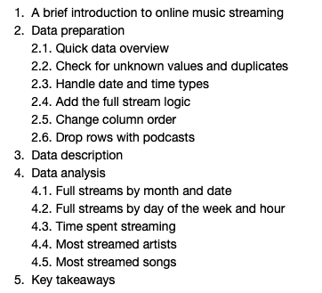
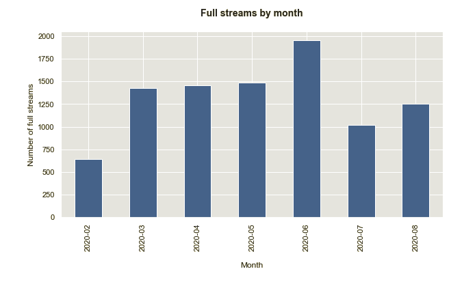
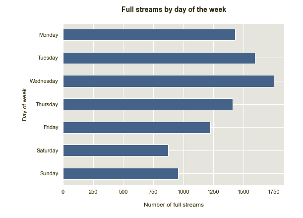
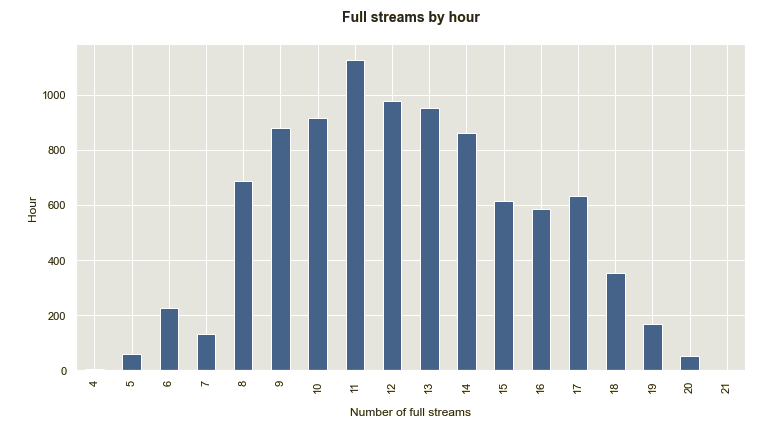
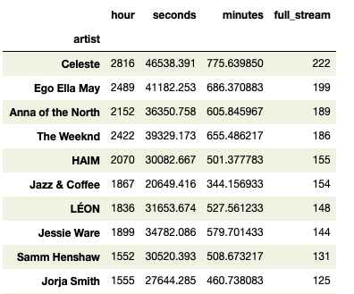
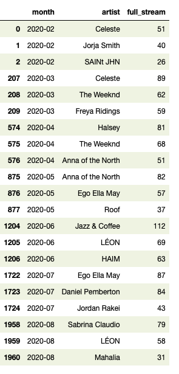
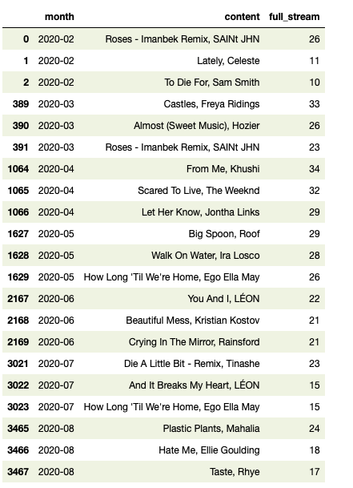
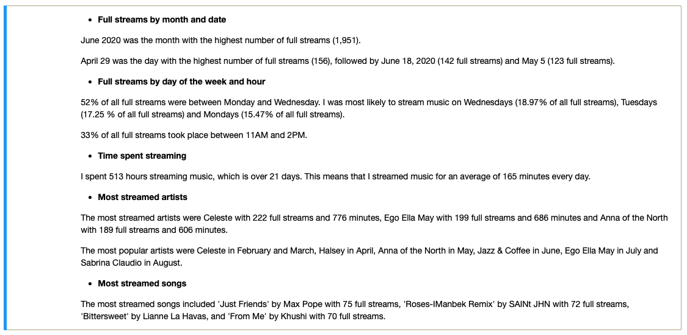

# my-spotify-streaming-habits
An exploratory data analysis of my Spotify streaming habits

 ## Table of contents
* [General info](#general-info)
* [Technologies](#technologies)
* [Setup](#setup)
* [Status](#status)

## General info
This project is an exploratory data analysis of my personal Spotify data. 
	
## Technologies
Project is created with Python - version: 3.8.5. 

Python libraries:
* pandas - version 1.1.1
* numpy - version 1.19.1
* matplotlib - version 3.3.1
* seaborn - version 0.10.1
	
## Setup
The input data consists of two json files: 
- StreamingHistory0.json 
- StreamingHistory1.json

The output data:
- my-spotify-streaming-habits.ipynb (Jupyter Notebook)

## Project flow

## Screenshots

Full streams:

Top artists:

3 most popular artists per month:

3 most popular songs per month:

## Key takeaways

## Status
This project is finished.
